# Serverless data pipeline on AWS — provisioned with Terraform

An event-driven pipeline where a CSV upload to S3 automatically triggers a Lambda
function that transforms the data and stores it in DynamoDB. CloudWatch monitors
the Lambda function for errors and SNS sends an email alert on failure. Every
resource — S3 bucket, Lambda, DynamoDB table, IAM roles, CloudWatch alarm, SNS
topic — is provisioned entirely through Terraform. No manual console steps.

## Architecture

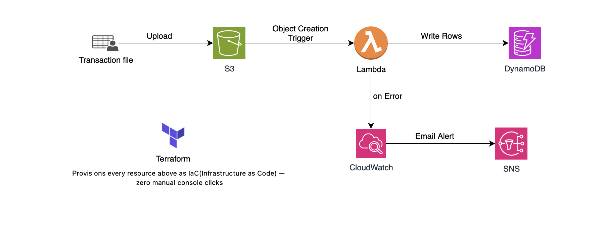

A CSV uploaded to S3 triggers a Lambda function via an S3 event notification.
Lambda reads and transforms the file, then writes rows to DynamoDB. If the
Lambda invocation errors, a CloudWatch alarm fires and publishes to an SNS
topic, which emails the alert. IAM roles enforce least-privilege access: the
Lambda execution role can only `GetObject` from the specific input bucket and
`PutItem`/`BatchWriteItem` on the specific DynamoDB table — nothing broader.

## Tech stack

| Terraform          | — Infrastructure as Code for every resource below
| AWS Lambda         | -(Python 3.12) — serverless compute, triggered by S3 events
| Amazon S3.         | — event source / file landing zone
| Amazon DynamoDB    | — NoSQL storage, provisioned capacity (free-tier safe)
| Amazon CloudWatch  | — error metric alarm on the Lambda function
| Amazon SNS         | — email notification on failure
| IAM                | — least-privilege execution role and policies

## Repo structure

```
aws-serverless-pipeline/
  terraform/
    main.tf          # provider, S3 bucket, S3 notification, DynamoDB table
    variables.tf      # input variables (region, project name, alert email)
    outputs.tf         # bucket name, table name, function name, SNS ARN
    lambda.tf           # Lambda function + zip packaging + S3 invoke permission
    iam.tf                # execution role + least-privilege policies
    monitoring.tf          # CloudWatch alarm + SNS topic/subscription
  lambda/
    handler.py              # Lambda function code
  sample-data/
    transactions.csv          # valid test file for manual upload
    broken-transactions.csv     # missing columns — deliberately triggers a Lambda error
  arc/
    IaC-Serverless.png    # architecture diagram embedded above
  screenshots/
    ......                 #screenshots of output
  README.md
  .gitignore
```

## Deploy

```bash
cd terraform

terraform init

terraform plan -var="alert_email=you@example.com"

terraform apply -var="alert_email=you@example.com"
```

**Confirm the SNS subscription** — AWS emails you a confirmation link after
`apply`. The alarm cannot deliver alerts until you click it.

## Test the pipeline

```bash
# Get the bucket name from Terraform's output
terraform output s3_bucket_name

# Upload the sample file
aws s3 cp ../sample-data/transactions.csv s3://<bucket-name-from-output>/

# Confirm the rows landed in DynamoDB
aws dynamodb scan --table-name $(terraform output -raw dynamodb_table_name)
```

### Testing the failure path

`sample-data/broken-transactions.csv` is missing required columns on purpose.
Uploading it makes the Lambda function throw a `KeyError`, which CloudWatch
records as an error on the function. Once the `Errors` metric crosses the
alarm threshold, the alarm fires and SNS emails the alert.

```bash
aws s3 cp ../sample-data/broken-transactions.csv s3://<bucket-name-from-output>/
```

Allow a minute or two for the alarm's evaluation period to elapse, then check
the CloudWatch Alarms console and your inbox. Afterward, delete the broken
file from the bucket so the alarm can return to `OK`.

## Proof of deployment

Screenshots of a real deploy and a real, deliberately triggered failure —
not just the code.

**1. `terraform plan`** — preview before any resources are created
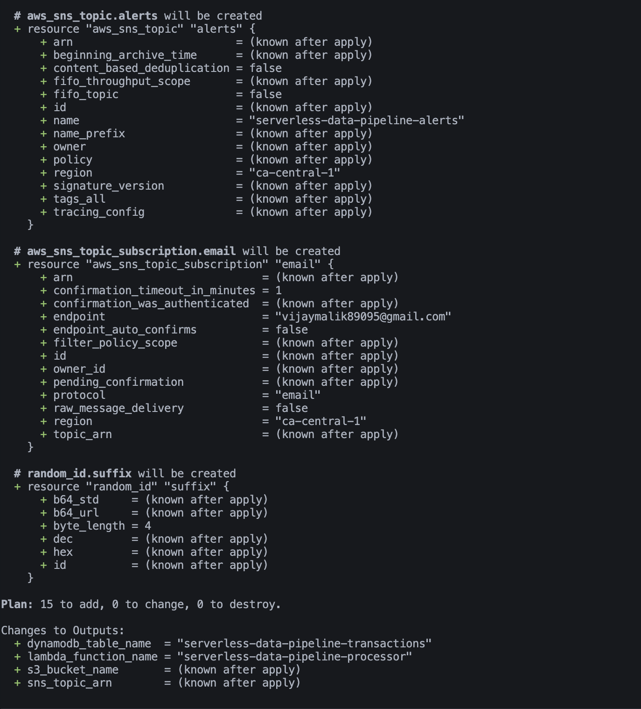

**2. `terraform apply`** — successful deploy with resource outputs
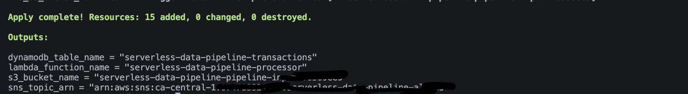

**3. S3 bucket** — uploaded CSV sitting in the input bucket
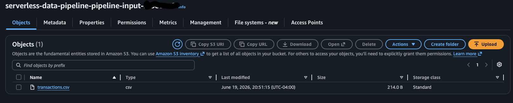

**4. DynamoDB table** — rows written by the Lambda function
Before inserting rows:
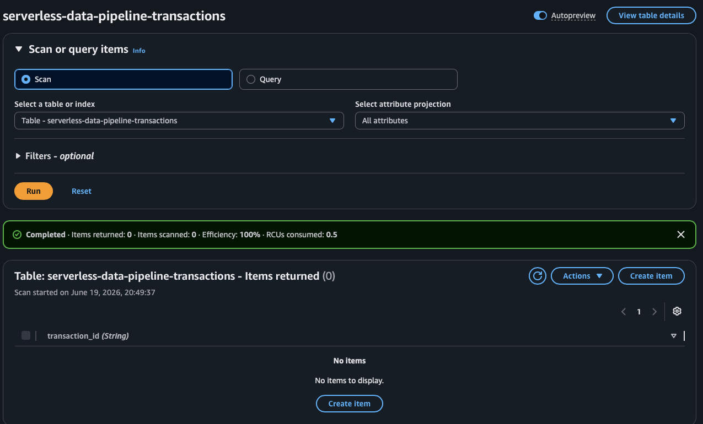
After inserting rows:
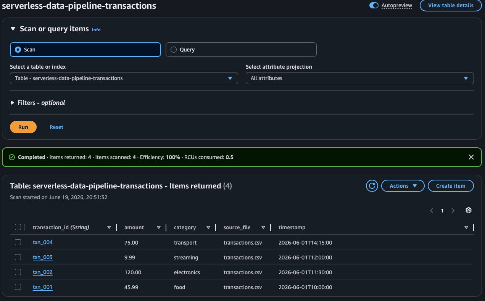

**5. Lambda configuration** — runtime, S3 trigger, and environment variable
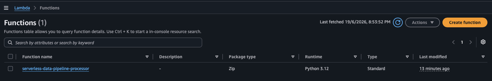

**6. CloudWatch Logs** — a successful Lambda execution processing rows
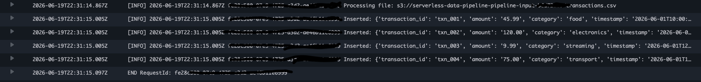

**7. CloudWatch Alarm** — tripped into `ALARM` state after an intentionally
malformed upload (`broken-transactions.csv`), proving the error path is wired
correctly end to end
Before Alarm trigger
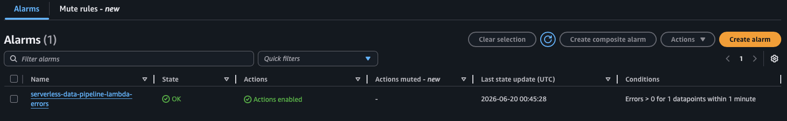
After Alarm trigger
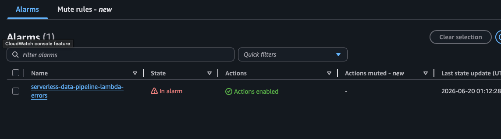

**8. SNS email alert** — the actual notification delivered to an inbox
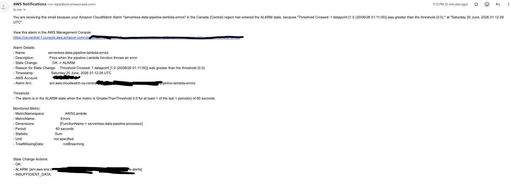


## Tear down

Every resource here can incur cost while it exists. Destroy when you're done:

```bash
terraform destroy -var="alert_email=you@example.com"
```
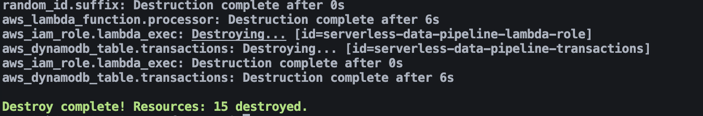

## What this project demonstrates

- Infrastructure as Code: 100% of resources defined in version-controlled `.tf` files, zero console clicking
- Event-driven serverless architecture (S3 → Lambda → DynamoDB)
- Least-privilege IAM design (scoped to specific ARNs, not wildcard resources)
- Observability: CloudWatch error alarm wired to an SNS email alert, verified
  end-to-end with a deliberately malformed file (see Proof of Deployment)
- Clean separation of concerns across Terraform files (compute, data, IAM, monitoring)